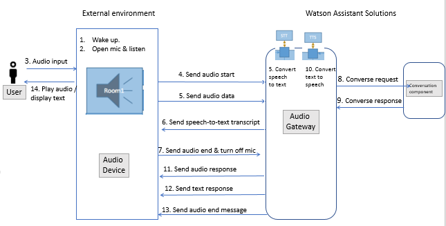

---
How the audio gateway works
---
If you have  IBM Watson Assistant for Hospitality, you have access to a single-tenant audio gateway.  The gateway is responsible for processing audio and for controlling IoT devices.

#### Audio input
For a single-tenant audio gateway, the flow for processing audio input in Watson Assistant Solutions is depicted in figure 1.
Figure 1 - audio flow

The steps in this flow are as follows:
1. The audio client processes a wake-up command.
2. The audio client opens its microphone and listens.
3. The audio client receive audio input from a user utterance.
4. The audio client uses a `tokens` REST API endpoint to request an authorization token. See _Authenticating audio devices_ for more information.
5. The audio gateway provides a time-sensitive token which the client appends to all calls to the gateway.
5. The audio client establishes a websocket connection to the gateway.
6. The audio client sends an `audio start` message to the audio gateway.
7. For each chunk of binary audio data in the utterance, the audio client sends the audio that is captures in an `audio data` message. The audio gateway converts the audio input to text in real-time using a speech-to-text service.
8. The audio gateway sends `speech-to-text transcript` messages to the audio client.
9. The audio client sends an `audio end` message to the gateway and turns off its microphone.
10. The audio gateway forwards the text input to the routing core.
11. The routing core sends the utterance to the conversation component for evaluation and processing. The skill with the highest confidence processes the request and sends a response. The conversation component forwards the converse response from the skill to the audio gateway. For details of these steps, see [How routing works][4dd4332b].
12. If an audio response is being sent, the audio gateway coverts the response from the routing core to audio using a text-to-speech service.  The gateway sends each chunk of binary audio data to the client in real-time.
13. If a text response is being sent, the audio gateway forwards the text reply to the device.
14. The audio gateway sends an `audio end` message.
15. The audio client plays the audio response or displays the text response, or both. The audio client checks if the audio gateway set the prompt parameter to true in the audio end message. If true, the skill expects a response from the audio client, and the steps are repeated from step 3.  Otherwise the audio client waits for a new wake-up command.

#### IoT control
The single-tenant audio gateway is also designed to
  [4dd4332b]: https://watson-personal-assistant.github.io/developer/understand-service/how-it-works/ "How routing works"
